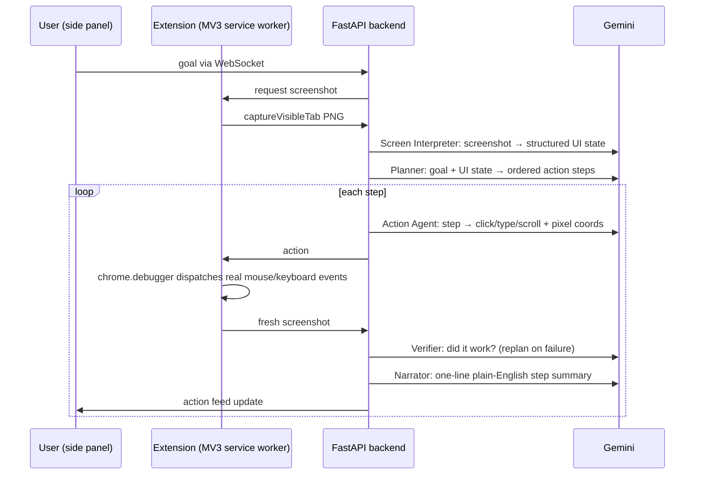

# Pilot: Visual Workflow Agent

**Type a goal. Watch the browser do it.**

**At a glance**

| | |
|---|---|
| **Question** | Can an agent operate any web app from a plain-English goal by looking at the screen? |
| **Data** | No dataset: a working prototype, with a reliability review in the README |
| **Result** | Five Gemini-powered agents (screen interpreter, planner, action, verifier, narrator); a failed check triggers replanning |
| **Stack** | Python, FastAPI, WebSockets, React, Chrome MV3, Gemini |
| **Project page** | [sanjanamaini.github.io/pilot](https://sanjanamaini.github.io/pilot/?utm_source=github&utm_medium=readme&utm_campaign=pilot) |

Pilot automates browser UI tasks from natural-language instructions ("Move this lead to Proposal Sent") purely by *looking at the screen*, with no per-app API integrations and no brittle DOM selectors. A five-agent pipeline interprets screenshots, plans atomic UI actions, executes them through Chrome's debugger protocol, verifies the result visually, and narrates each step in a side panel.

## Architecture



The five agents (`backend/agents/`):

| Agent | Input | Output |
|---|---|---|
| `screen_interpreter` | screenshot | structured UI state: app, page context, interactive elements with bounding boxes |
| `planner` | goal + UI state | ordered list of atomic steps (JSON), with a replan path |
| `action_agent` | one step + screenshot | a precise action (click/type/scroll/navigate/keypress) with pixel coordinates |
| `verifier` | post-action screenshot | success/failure judgment; failure triggers replanning |
| `narrator` | completed step | one-sentence description for the action feed |

Because every decision is made from pixels, Pilot works on any web app it can see. The trade-off is that each step costs a Gemini vision call, and reliability depends on the verifier catching mis-clicks (which is why verification is a first-class pipeline stage, not an afterthought).

## Tech stack

- **Backend**: Python 3, FastAPI, WebSockets, `google-genai` SDK, Pydantic (`backend/requirements.txt`)
- **Model**: `gemini-2.5-pro` (pinned in `backend/gemini_client.py`; key read from the `GOOGLE_API_KEY` env var, never hardcoded)
- **Extension**: React 18 + Vite 5, Chrome Manifest V3: side panel UI, background service worker using `chrome.debugger` + `chrome.tabs`
- **Infra**: Dockerfile + Terraform (Cloud Run, Artifact Registry, Firestore) + `infra/deploy.sh`: IaC scaffolding, not verified as a live deployment

## Run it

Backend:
```
cd backend
pip install -r requirements.txt
set GOOGLE_API_KEY=your_key_here    # Windows; use export on macOS/Linux
python main.py
```
Serves `http://localhost:8000` (health check at `/health`).

Extension:
```
cd extension
npm install
npm run build
```
Load `extension/dist/` as an unpacked extension at `chrome://extensions/` (Developer Mode), open the side panel, type a goal.

## Honest status

Working end-to-end prototype: instruction in → verified UI actions out, with live narration. Session state is in-memory per session (`backend/session_manager.py`); Firestore appears in the Terraform config but is not wired into the code. The cloud deployment scripts are scaffolding; treat local as the supported path. Until 2026-10-07, clicks on displays scaled above 100% landed in the wrong place (see the reliability review below).

## Reliability review (2026-10-07)

A code review of the orchestration loop, three fixes with tests, and a model of how reliable a
screenshot-driven loop like this one can be: `notebooks/reliability_model.ipynb`.

**Fixed**

- **Unbounded replanning.** A step that kept failing replanned forever, at five model calls per round. Replans
  are now capped at `MAX_REPLANS = 3` per goal (`backend/main.py`), after which the run fails visibly.
- **Clicks on scaled displays.** `captureVisibleTab` returns device pixels; Chrome's `Input.dispatchMouseEvent`
  takes CSS pixels. On any display scaled above 100% (every Retina Mac, most Windows laptops at 125% or 150%),
  each click landed at a multiple of the intended point. The extension now divides by `devicePixelRatio`
  (`extension/src/background.js`). This one needs a manual check in Chrome.
- **Coordinates without a frame.** The action prompt now states the screenshot's size, read from the PNG
  header, and a click outside the image fails the step instead of firing (`backend/agents/action_agent.py`).
- Python 3.9 compatibility in the planner; docstrings now name the pinned model.

Tests (no API key needed; every model call is stubbed): `cd backend && python -m unittest discover tests`
runs 11 tests, including one showing that without the cap the same failing step never stops.

**What the model says.** Every rate in it is an assumption; nothing here is a measurement of Pilot.

- **The verifier sets the ceiling.** In a six-step base case (actions right 90% of the time, a verifier that
  catches 85% of failures), about one run in ten that Pilot reports as complete is wrong, whatever the replan
  cap. Retries make Pilot finish more often; they do not make a finish more trustworthy.
- **"Loading means success" creates false passes.** The verifier prompt passes any page still loading, and
  the screenshot is taken after a fixed 1.5 s. With a median page settle time of 2 s, silent failures reach
  one run in three; treating loading as *pending* and looking again holds them near 12%.
- **Measure with fault injection.** Estimating the verifier's catch rate needs labelled failures. Breaking
  steps on purpose (disable a button, delay a page) gets about 50 of them far faster than the roughly 80
  tasks needed to see them occur naturally.

**Recommended next** (not changed, because prompt changes cannot be tested without a key): a `pending`
verdict for loading pages; use the verifier's confidence, which is returned and ignored; a concrete expected
outcome per step from the planner instead of "the UI should reflect the completion of: {step}"; retry or
fail visibly on an unparseable plan instead of running "Attempt to: {goal}"; wait for two matching
screenshots instead of a fixed 1.5 s; check the WebSocket `Origin` header.
