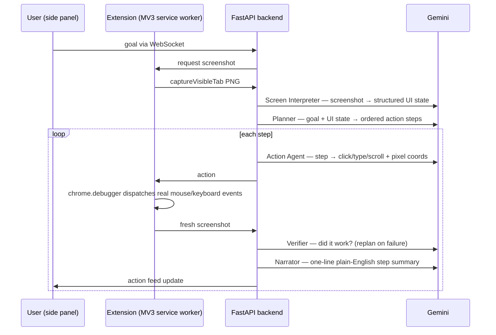

# Pilot — Visual Workflow Agent

**Type a goal. Watch the browser do it.**

Pilot automates browser UI tasks from natural-language instructions ("Move this lead to Proposal Sent") purely by *looking at the screen* — no per-app API integrations, no brittle DOM selectors. A five-agent pipeline interprets screenshots, plans atomic UI actions, executes them through Chrome's debugger protocol, verifies the result visually, and narrates each step in a side panel.

## Architecture



The five agents (`backend/agents/`):

| Agent | Input | Output |
|---|---|---|
| `screen_interpreter` | screenshot | structured UI state: app, page context, interactive elements with bounding boxes |
| `planner` | goal + UI state | ordered list of atomic steps (JSON), with a replan path |
| `action_agent` | one step + screenshot | a precise action — click/type/scroll/navigate/keypress with pixel coordinates |
| `verifier` | post-action screenshot | success/failure judgment; failure triggers replanning |
| `narrator` | completed step | one-sentence description for the action feed |

Because every decision is made from pixels, Pilot works on any web app it can see — the trade-off is that each step costs a Gemini vision call, and reliability depends on the verifier catching mis-clicks (which is why verification is a first-class pipeline stage, not an afterthought).

## Tech stack

- **Backend**: Python 3, FastAPI, WebSockets, `google-genai` SDK, Pydantic (`backend/requirements.txt`)
- **Model**: `gemini-2.5-pro` (pinned in `backend/gemini_client.py`; key read from the `GOOGLE_API_KEY` env var — never hardcoded)
- **Extension**: React 18 + Vite 5, Chrome Manifest V3 — side panel UI, background service worker using `chrome.debugger` + `chrome.tabs`
- **Infra**: Dockerfile + Terraform (Cloud Run, Artifact Registry, Firestore) + `infra/deploy.sh` — IaC scaffolding, not verified as a live deployment

## Run it

Backend:
```
cd backend
pip install -r requirements.txt
set GOOGLE_API_KEY=your_key_here    # Windows; use export on macOS/Linux
python main.py
```
Serves `http://localhost:8000` (health check at `/health`).

Extension:
```
cd extension
npm install
npm run build
```
Load `extension/dist/` as an unpacked extension at `chrome://extensions/` (Developer Mode), open the side panel, type a goal.

## Honest status

Working end-to-end prototype: instruction in → verified UI actions out, with live narration. Session state is in-memory per session (`backend/session_manager.py`); Firestore appears in the Terraform config but is not wired into the code. The cloud deployment scripts are scaffolding — treat local as the supported path.
